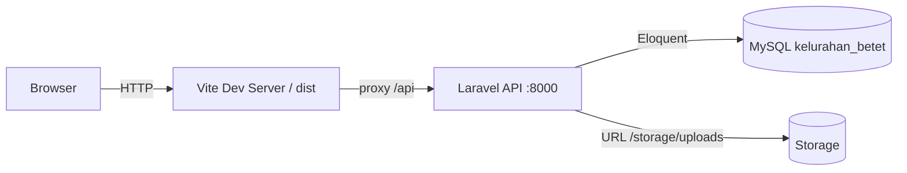
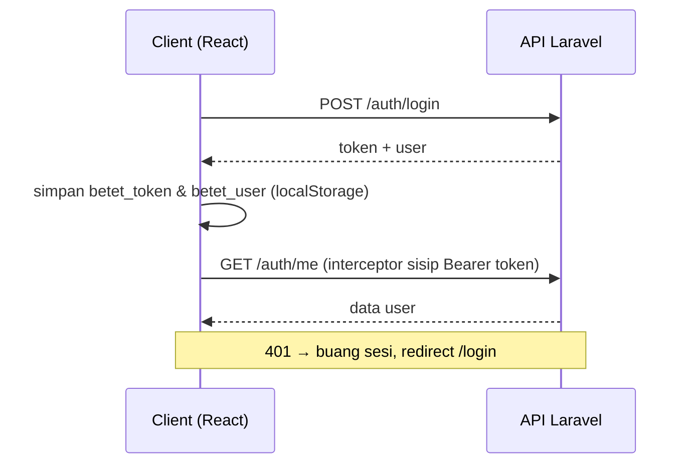

# Portal Kelurahan Betet — Frontend

[](https://react.dev)
[](https://vitejs.dev)
[](https://getbootstrap.com)
[](https://reactrouter.com)
[](https://axios-http.com)
[](#lisensi)

Website portal resmi Kelurahan Betet — layanan publik daring, pengajuan surat, pengaduan warga, hingga panel admin lengkap. Dibangun dengan **React + Vite + Bootstrap 5**, terhubung ke REST API **Laravel + MySQL**.

- Repositori: <https://github.com/DhabitHD/Sistem-Administrasi-Kelurahan-Online>

## Daftar Isi

- [Tentang Proyek](#tentang-proyek)
- [Fitur](#fitur)
- [Arsitektur & Alur](#arsitektur--alur)
- [Teknologi](#teknologi)
- [Struktur Proyek](#struktur-proyek)
- [Menjalankan](#menjalankan)
- [Akun Demo](#akun-demo)
- [Kontrak API](#kontrak-api)
- [Deployment](#deployment)
- [Push ke GitHub](#push-ke-github)
- [Kontribusi](#kontribusi)
- [Lisensi](#lisensi)

## Tentang Proyek

Portal Kelurahan Betet adalah aplikasi web dua sisi: halaman publik untuk informasi & layanan, dan area terautentikasi untuk warga (ajukan surat, kirim pengaduan) dan admin (verifikasi, kelola seluruh konten). Semua data diambil dari API backend Laravel lewat `contentStore.js` — tidak ada konten hardcoded untuk tampilan, sehingga perubahan admin langsung terlihat.

## Fitur

### Publik (tanpa login)

- **Beranda** — hero carousel bergambar, layanan unggulan, sambutan lurah, visi & misi, berita terbaru, pengumuman, kegiatan, video, dokumen publik, struktur pemerintahan
- **Profil** — sejarah, visi & misi, struktur organisasi, demografi (sub-halaman)
- **Pemerintahan** — daftar perangkat kelurahan
- **Berita / Pengumuman** — daftar + halaman detail (slug)
- **Layanan** — daftar layanan + detail dengan syarat & alur
- **Kegiatan** — agenda kelurahan
- **Dokumen** — unduh dokumen publik (simulasi via Blob)
- **Video** — galeri embed YouTube
- **Pencarian global** — `/cari` gabungan berita, pengumuman, layanan, dokumen, perangkat, video
- **Pengaduan & Pelacakan** — info pengaduan + lacak status via kode
- **Kontak & peta** — alamat, telepon, jam layanan, peta lokasi

### Warga (login)

- **Dashboard** — ringkasan aktivitas & notifikasi
- **Pengajuan surat online** — buat permohonan, pantau status
- **Pengaduan** — kirim dengan foto bukti, riwayat aduan
- **Riwayat & tracking** — timeline status item
- **Notifikasi in-app**
- **Profil** — ubah data + foto profil

### Admin (login)

- **Verifikasi warga** — lihat foto profil & KTP, data lengkap, setujui/tolak dengan catatan
- **Kelola pengaduan & surat** — ubah status, tindak lanjut
- **Kelola konten** — berita, pengumuman, dokumen, layanan, slide hero, video (tautan/upload), profil kelurahan & kontak, perangkat
- **Manajemen pengguna** — admin & petugas (tambah/edit/hapus + foto)
- **Dashboard** — statistik ringkas

## Arsitektur & Alur



Alur autentikasi (Sanctum token):



## Teknologi

| Kategori | Paket |
|---|---|
| UI | React 19, Bootstrap 5, `lucide-react` (via `AppIcon`), `bootstrap-icons` |
| Build | Vite 8, `@vitejs/plugin-react` |
| Routing | `react-router-dom` |
| Data | `axios` (instance terinterceptor) |
| Animasi | `lottie-react` (opsional), RevealOnScroll, motion CSS |
| Testing | `@playwright/test` (E2E) |
| Font | Sora (body), Bricolage Grotesque (display) |

## Struktur Proyek

```
src/
  pages/          public/, warga/, auth/, admin/
  components/     home/, content/, auth/, common/, layout/, common/AppIcon
  services/       api.js (axios + token), store.js (pengaduan/surat/warga/admin),
                  contentStore.js (cache berita/pengumuman/layanan/dokumen/perangkat/video/hero/profil),
                  video.js (helper embed YouTube)
  routes/         AppRoutes.jsx (route + guard + PageMeta + ScrollToTop)
  layouts/        PublicLayout, WargaLayout, AdminLayout
  contexts/       AuthContext.jsx (auth Sanctum + localStorage)
  data/           fallback statis (JANGAN dipakai untuk tampilan konten)
  styles/         app.css (brand biru --color-brand:#2563EB, motion polish)
```

## Menjalankan

**Prasyarat:** Node.js 18+, MySQL (via Laragon), dan backend Laravel di `kelurahan-betet-api`.

1. Jalankan backend — MySQL Laragon aktif, lalu di folder backend:
   ```bash
   php artisan serve --port=8000
   ```
   (opsional) seed data demo:
   ```bash
   php artisan db:seed --force
   ```

2. Install & jalankan frontend:
   ```bash
   npm install
   npm run dev
   ```
   Buka <http://localhost:5173>. Vite mem-proxy `/api` → `http://127.0.0.1:8000`.

3. Konfigurasi `.env` (contoh ada di `.env.example`):
   ```
   VITE_API_BASE_URL=/api
   ```

**Build produksi:** `npm run build` — ini satu-satunya verifikasi (tidak ada lint/test unit).

**E2E (opsional):** `npm run test:e2e` (Playwright).

## Akun Demo

Tersedia jika seeder dijalankan.

| Peran | Login | Password |
|---|---|---|
| Warga | `3571********1234` | `demo1234` |
| Admin | `admin@betet.id` | `admin1234` |

Refresh data demo: `php artisan db:seed --force` (idempotent) atau `php artisan migrate:fresh --seed`.

## Kontrak API

Spesifikasi lengkap endpoint backend ada di [`api-spec.md`](./api-spec.md).

Catatan status:

- Akun: `PENDING | VERIFIED | REJECTED`
- Item (surat/pengaduan): `DIAJUKAN | IN_PROGRESS | SIAP_DIAMBIL | CLOSED | DITOLAK`
- Komponen `StatusBadge` memetakan semua status di atas.

## Deployment

1. Ubah target backend di `vite.config.js` (proxy `/api`) dan `.env` `VITE_API_BASE_URL`.
2. `npm run build` → hasil di `dist/`.
3. Serve `dist/` sebagai static site; pastikan rute `/storage/uploads/*` dari backend tersaji (foto KTP, avatar, bukti pengaduan).
4. Atur rewrite SPA: semua rute tak dikenal arahkan ke `index.html`.
5. **Atur rewrite `/api` dengan urutan benar.** Vercel (`vercel.json`) dan Netlify/Cloudflare (`public/_redirects`) sudah punya aturan `/api/*` di atas catch-all SPA, dan keduanya memakai env var `$API_ORIGIN` (tanpa `https://`, tanpa garis bawah akhir):

   ```
   API_ORIGIN=https://api.kelurahan-betet.go.id
   ```

   Kalau API di-reverse-proxy di domain yang sama, hapus saja aturan `/api/*` — cukup sisakan catch-all. Kalau tidak, `/api/*` tidak cocok dengan file statis dan jatuh ke `index.html`, sehingga setiap request axios menerima HTML dan seluruh portal mati.
6. Kalau API berada di origin berbeda, tambahkan origin tersebut ke `connect-src` di ketiga file header (`public/.htaccess`, `public/_headers`, `vercel.json`) — default-nya `connect-src 'self'` akan memblokir semua request.

## Push ke GitHub

Repo belum di-inisialisasi (belum ada `.git`). Langkah pertama kali:

```bash
git init
git add .
git commit -m "Initial commit"
git branch -M main
git remote add origin https://github.com/DhabitHD/Sistem-Administrasi-Kelurahan-Online.git
git push -u origin main
```

`.gitignore` sudah mengecualikan `node_modules/`, `dist/`, dan `.env` — jangan commit file tersebut.

## Kontribusi

1. Fork repo ini.
2. Buat branch fitur: `git checkout -b fitur/nama-fitur`.
3. Commit perubahan dengan pesan jelas (Bahasa Indonesia/Inggris bebas).
4. Jalankan `npm run build` sebelum push untuk memastikan tidak ada error.
5. Buka Pull Request ke `main` dengan deskripsi perubahan.

## Lisensi

Dirilis di bawah lisensi **MIT**. Lihat file [LICENSE](./LICENSE) untuk detail.

---

© 2026 Kelurahan Betet. Dibuat untuk pelayanan publik yang lebih mudah dan transparan.
